# Content Understanding × GitHub Copilot

## L400 Developer Workshop Overview

> Build, secure, deploy, and operate a document-intelligence RAG application with GitHub, GitHub Copilot, GitHub Actions, Azure Content Understanding, Azure AI Search, GPT-5, and Azure Container Apps.

- **Level:** L400 — source-level architecture and implementation
- **Duration:** 3.5–4 hours
- **Audience:** Senior developers, platform engineers, DevOps engineers, and solution architects
- **Live workshop:** <https://ibranibeny.github.io/content-understanding-github-workshop/>
- **Reference application:** <https://github.com/ibranibeny/content-understanding-rag-demo>
- **Workshop repository:** <https://github.com/ibranibeny/content-understanding-github-workshop>

---

## 1. Workshop purpose

This workshop follows one software change from a developer branch to a grounded answer in production. It treats GitHub, CI/CD, cloud identity, asynchronous document processing, retrieval, generation, and operational evidence as one connected system rather than a series of unrelated product demonstrations.

Participants do more than provision resources or observe a model response. They inspect the controls that make the response trustworthy: immutable commits, required checks, OIDC, SHA-tagged images, state transitions, queue delivery, lease and ETag fencing, deterministic chunks, session-filtered retrieval, validated citations, telemetry redaction, and deletion cleanup.

The workshop therefore covers:

- Git and GitHub collaboration flow.
- Pull requests, required checks, CI, and CodeQL.
- GitHub Actions authentication to Azure through OIDC.
- Container image provenance using immutable commit SHA tags.
- Two-phase direct-to-Blob upload and PDF page ranges.
- Asynchronous Content Understanding processing.
- Queue visibility, Blob leases, ETags, retries, and poison handling.
- Markdown chunking, embeddings, and Azure AI Search.
- GPT-5 grounded generation and citation validation.
- Application Insights telemetry and data redaction.
- Tombstone-based deletion and retention cleanup.

---

## 2. Learning objectives

The workshop is designed for engineers who need to explain both application behavior and the controls around that behavior. Every objective can be demonstrated through source code, a GitHub record, an Azure resource, telemetry, or a browser observation.

By the end, participants should be able to connect one user-visible answer to the exact release and evidence that produced it. They should also be able to predict how the design behaves under throttling, duplicate delivery, stale workers, invalid citations, and deletion races.

Participants will be able to:

1. Explain the distinct roles of Git, GitHub, GitHub Actions, and GitHub Copilot.
2. Implement a protected GitHub flow using branches, commits, pull requests, CI, CodeQL, and merge gates.
3. Authenticate GitHub Actions to Azure without a stored client secret.
4. Trace a document through every ingestion state.
5. Explain the Content Understanding analyzer and long-running operation contract.
6. Implement deterministic chunking and 3,072-dimensional embeddings.
7. Design a session-isolated Azure AI Search index.
8. Prevent unsupported citation identifiers from reaching users.
9. Diagnose throttling, poll timeout, lease loss, ETag conflict, and poison-message scenarios.
10. Correlate a Git commit, container image, Azure revision, trace, and browser result.

---

## 3. Workshop journey

The learning sequence starts with software delivery because the runtime result is meaningful only after its source and release path are known. Participants establish the repository baseline, inspect AI-assisted development controls, and then follow the application from upload through deletion.

The modules deliberately move from control plane to data plane and from normal operation to failure handling. This order gives the audience a stable mental model before concurrency, retries, and recovery introduce competing timelines.

```mermaid
flowchart LR
    A[Understand GitHub] --> B[Use GitHub Copilot]
    B --> C[Inspect Content Understanding]
    C --> D[Build the document scenario]
    D --> E[Trace implementation internals]
    E --> F[Review Azure architecture]
    F --> G[Deploy through GitHub Actions]
    G --> H[Verify the production application]
    H --> I[Inject failures and operate]
```

| Module | Topic | Participant outcome |
|---|---|---|
| 01 | GitHub and CI/CD | Trace a change from branch to production |
| 02 | GitHub Copilot | Use AI assistance inside engineering controls |
| 03 | Content Understanding | Explain analyzers, extraction, and structured output |
| 04 | Workshop scenario | Upload, process, search, cite, and delete synthetic evidence |
| 05 | L400 implementation | Inspect state, leases, retries, Search, and citation validation |
| 06 | Azure architecture | Separate release, ingestion, retrieval, and operations paths |
| 07 | Deployment | Provision once, release from GitHub, and verify production |

---

## 4. Solution scenario

A participant uploads a deterministic, synthetic financial report and selects a PDF page range. The browser sends the file directly to Blob Storage using a short-lived user-delegation SAS, while the API retains control over session ownership, destination, size, page scope, expiry, and quota.

The application then turns that upload into structured and searchable evidence. The scenario finishes only after the participant asks a known question, opens the cited source, verifies the claim, deletes the document, and confirms that quota and physical artifacts follow the documented lifecycle.

The runtime path is:

1. Reserve session document count and bytes atomically.
2. Generate a create/write-only user-delegation SAS.
3. Upload the file directly to Azure Blob Storage.
4. Commit the document state and durable outbox message.
5. Dispatch asynchronous ingestion through Azure Queue Storage.
6. Classify and extract the document with Content Understanding.
7. Normalize structured JSON and layout-aware Markdown.
8. Split Markdown into deterministic overlapping chunks.
9. Create 3,072-dimensional vectors.
10. Index session-scoped chunks in Azure AI Search.
11. Retrieve evidence for a precise question.
12. Stream a grounded GPT-5 answer.
13. Validate every citation against the retrieved evidence set.
14. Hide the document through a tombstone and remove its artifacts under lease.

---

## 5. Azure architecture

The architecture has two intentionally separate paths. The delivery path changes executable software through GitHub review, required checks, OIDC, ACR, and Container Apps revisions; the evidence path moves user-selected document content through Storage, Content Understanding, embeddings, Search, and grounded generation.

Read the diagram from left to right along the GitHub lane first, then traverse the Azure runtime twice. The first runtime pass is ingestion—from browser upload to indexed chunks—while the second is question answering—from session-filtered retrieval to a validated citation returned by the frontend.

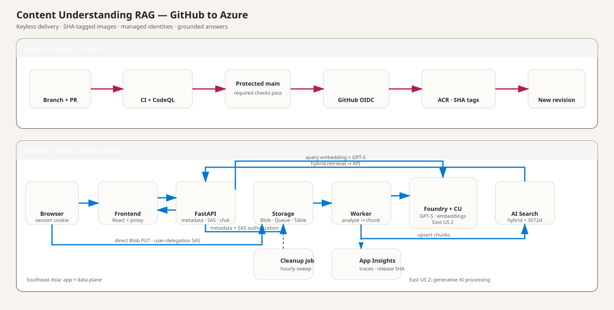

- [Download the SVG architecture](assets/content-understanding-rag-architecture.svg)
- [Download the editable Draw.io architecture](assets/content-understanding-rag-architecture.drawio)

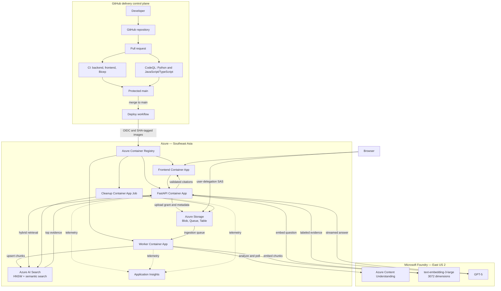

Southeast Asia contains the application and data plane: frontend, API, worker, cleanup job, Storage, AI Search, ACR, and Application Insights. This grouping lets participants correlate one browser action with Blob, Queue, Table, Search, revision, and trace evidence inside a clear operating boundary.

East US 2 contains Microsoft Foundry, Content Understanding, GPT-5, and `text-embedding-3-large`. Selected document content and retrieved evidence cross regions for AI processing, so facilitators must obtain regional processing approval and use only synthetic, non-confidential data.

| Region | Resources |
|---|---|
| Southeast Asia | Frontend, API, Worker, Cleanup Job, Storage, AI Search, ACR, Application Insights |
| East US 2 | Microsoft Foundry, Content Understanding, GPT-5, text-embedding-3-large |

---

## 6. Git and GitHub delivery flow

Git creates immutable change history, while GitHub turns that history into a governed decision process. A branch isolates work, an atomic commit preserves intent, a pull request exposes the review surface, and required checks determine whether the change is eligible for promotion.

The Deploy workflow starts only after the reviewed change reaches `main`. It exchanges a GitHub OIDC token for Azure access, builds images tagged with the merge SHA, updates Container Apps, waits for revision provisioning, bootstraps data-plane contracts, and runs the deployed smoke journey.

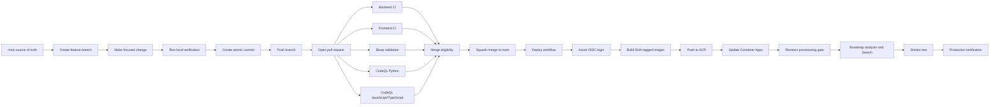

### One-time OIDC and platform bootstrap

The facilitator establishes cloud and trust foundations before the Git evidence trail. OIDC provisioning requires both the names and immutable numeric IDs of the GitHub owner and repository, so obtain all four values from the repository REST metadata and save them in the selected azd environment before running Bicep.

The initial local helper may use ACR Tasks for non-release bootstrap, but subsequent releases come only from reviewed pushes to `main`. After provisioning, retrieve `GITHUB_IDENTITY_CLIENT_ID` from the Bicep outputs and pass it to the GitHub configuration script, which creates the `production` environment, publishes non-secret variables, and applies the required-check ruleset.

```powershell
az login
gh auth status
$repo = "<owner/repository>"
$repoMetadata = gh api "repos/$repo" | ConvertFrom-Json
$ownerId = [string]$repoMetadata.owner.id
$repositoryId = [string]$repoMetadata.id

azd env select cudemo 2>$null
if ($LASTEXITCODE -ne 0) {
    azd env new cudemo --no-prompt
}
azd env set AZURE_GITHUB_OWNER $repoMetadata.owner.login
azd env set AZURE_GITHUB_OWNER_ID $ownerId
azd env set AZURE_GITHUB_REPOSITORY $repoMetadata.name
azd env set AZURE_GITHUB_REPOSITORY_ID $repositoryId

$subscriptionId = az account show --query id -o tsv
$tenantId = az account show --query tenantId -o tsv
./scripts/deploy.ps1 -WhatIf -EnvironmentName cudemo -Subscription $subscriptionId
./scripts/deploy.ps1 -EnvironmentName cudemo -Subscription $subscriptionId

$githubClientId = azd env get-value GITHUB_IDENTITY_CLIENT_ID
./scripts/configure-github.ps1 `
    -Repo $repo `
    -AzureClientId $githubClientId `
    -AzureTenantId $tenantId `
    -AzureSubscriptionId $subscriptionId `
    -EnvironmentName cudemo
```

Retain the subscription and tenant IDs, repository names and IDs, deployment client ID, resource group, API, frontend, worker, and cleanup names, frontend and API URLs, and release SHA. `azd env get-values` displays the Bicep outputs consumed by later image-provenance, cleanup, browser, and telemetry checkpoints.

---

## 7. Sequential GitHub evidence trail

The screenshots reconstruct one completed change using durable GitHub records: feature commit `dc77911`, pull request `#15`, squash merge `7763b09`, and deployment run `33872688415`. Each record proves a different part of the release contract and should be interpreted together.

The images are retrospective evidence aligned with each action. They do not claim that every screen was captured live before merge; instead, they demonstrate how an operator audits an already completed delivery chain without relying on memory or private context.

### Step 1 — Establish the source of truth

Clone the public repository, switch to `main`, and locate the application, workflow, infrastructure, analyzer, script, and test boundaries. This baseline is necessary because a later diff has meaning only relative to a known branch and commit.

The checkpoint is complete when local `HEAD` equals `origin/main`, the working tree is clean, and the participant can identify the files that control CI, deployment, Bicep, backend, frontend, and analyzer behavior.

```powershell
git clone https://github.com/ibranibeny/content-understanding-rag-demo.git
Set-Location content-understanding-rag-demo
git switch main
git pull --ff-only
```

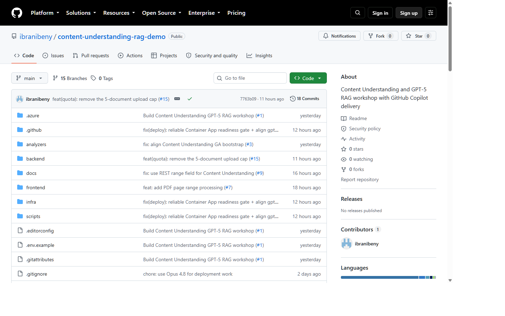

### Step 2 — Create one atomic commit

Create a focused branch, make one bounded behavioral change, and run the smallest test that can falsify it before expanding verification. The commit becomes the immutable unit referenced by checks, review, release artifacts, and later rollback.

The checkpoint is complete when the commit explains one behavior, contains no secrets or unintended generated files, passes local verification, and can be reverted independently from unrelated work.

```powershell
git switch -c feat/my-change
# Edit and run relevant verification.
git status --short
git diff --check
git add <changed-files>
git commit -m "feat(scope): describe the behavior"
```

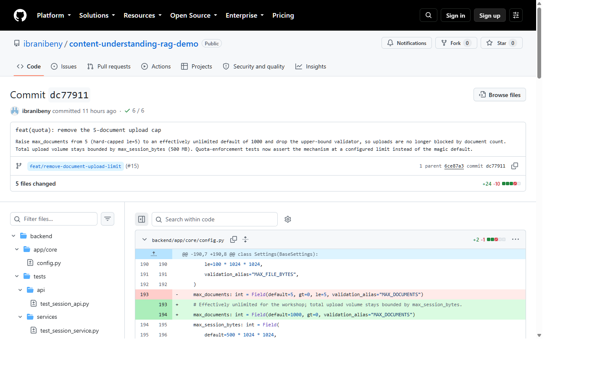

### Step 3 — Open a pull request with evidence

Push the branch and open a pull request that explains the problem, intended behavior, architecture and security impact, test evidence, and rollback path. The pull request turns private implementation work into a shared engineering decision.

The checkpoint is complete when reviewers can evaluate every acceptance criterion without private context and the changed-file list contains only the intended implementation, test, and documentation updates.

```powershell
git push -u origin feat/my-change
gh pr create --base main --fill
```

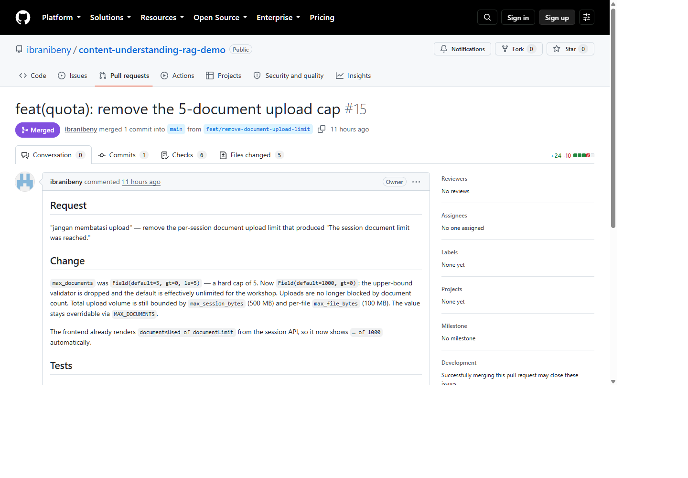

### Step 4 — Pass CI and security gates

Inspect each backend, frontend, Bicep, policy, and CodeQL result instead of treating a green summary as one undifferentiated signal. A successful unit test cannot compensate for invalid infrastructure, and a production build cannot compensate for a security-analysis failure.

The checkpoint is complete when CI and CodeQL identify the feature commit and report success. Repository rules must be inspected separately to prove which checks are required, because a workflow screenshot proves execution results rather than branch-policy configuration.

```powershell
gh pr checks <pr-number> --watch
gh run view <run-id> --log-failed
```

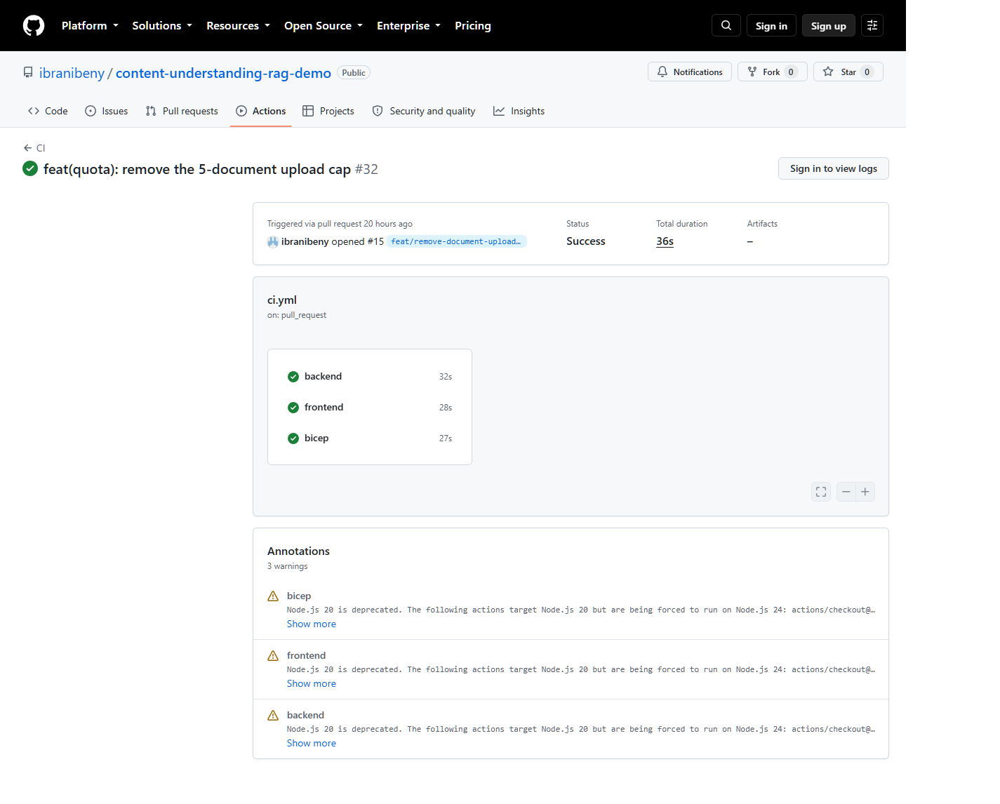

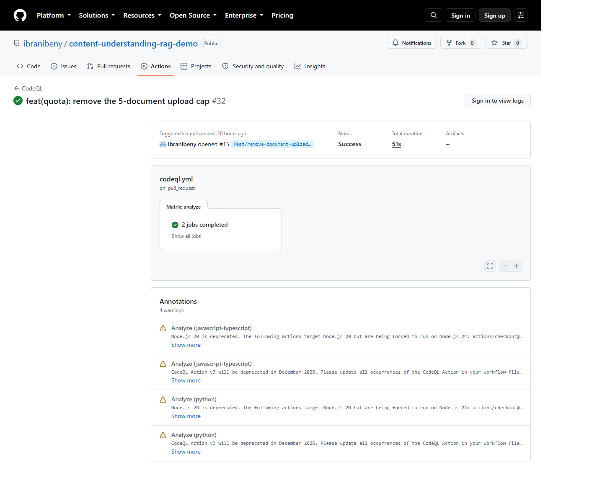

### Step 5 — Merge the reviewed source

Squash-merge only after the repository's current policy is satisfied, then record the resulting `main` SHA. PR `#15` did not require human approval, so its durable promotion evidence is the successful checks plus the merge record.

The checkpoint is complete when the PR is merged, the merge commit is reachable from `origin/main`, and the production workflow was triggered by that push rather than by a developer laptop.

```powershell
gh pr merge <pr-number> --squash
git fetch origin
git show --stat origin/main
```

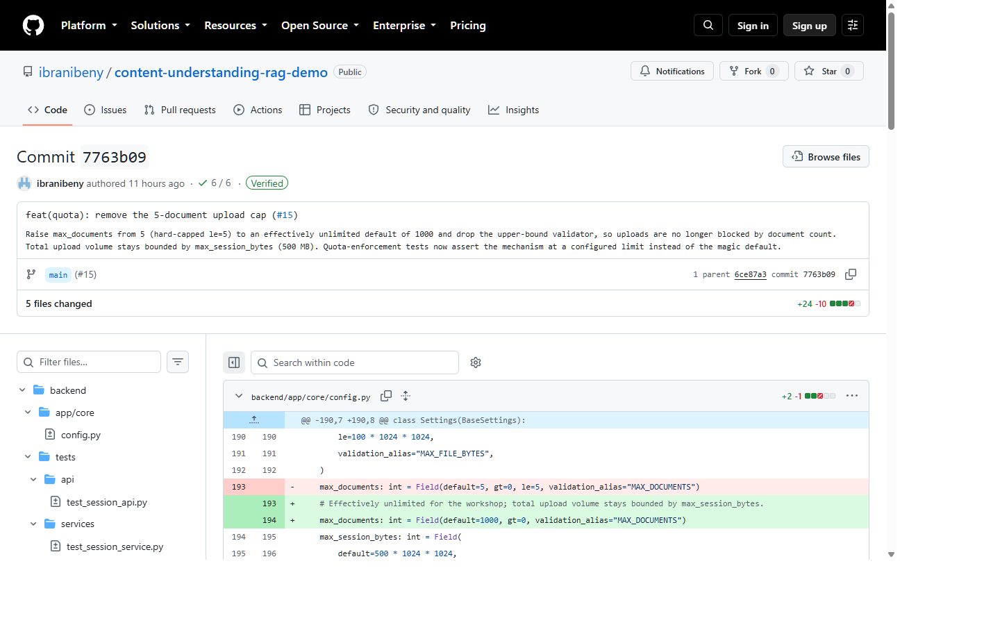

### Step 6 — Release with GitHub Actions OIDC

Follow the deployment run from GitHub OIDC login through ACR push, Container Apps update, revision provisioning, Content Understanding and Search bootstrap, proxy readiness, and smoke test. OIDC removes the stored Azure client secret, while the merge SHA binds source, image, revision, and telemetry.

The checkpoint is complete when the workflow reports success, the deployed image tag ends with the merge SHA, the revisions are provisioned, and all bootstrap, readiness, and smoke-test gates are green.

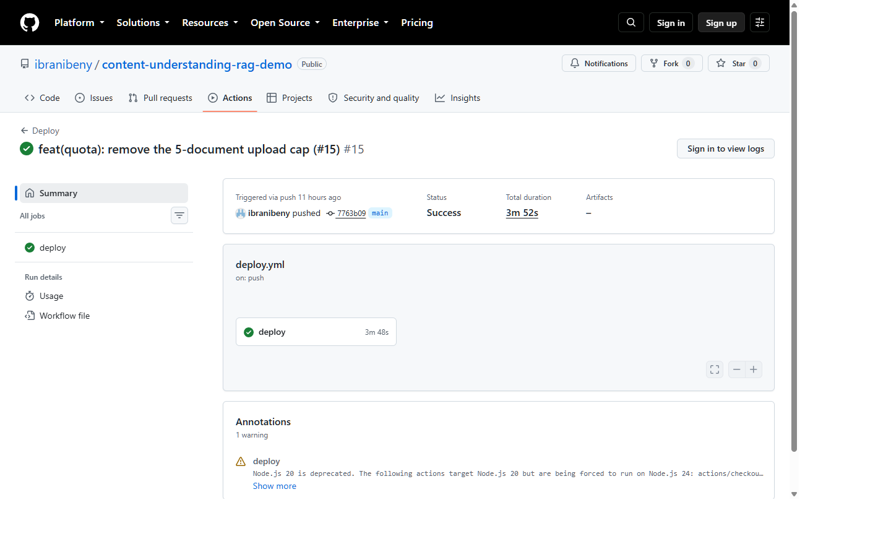

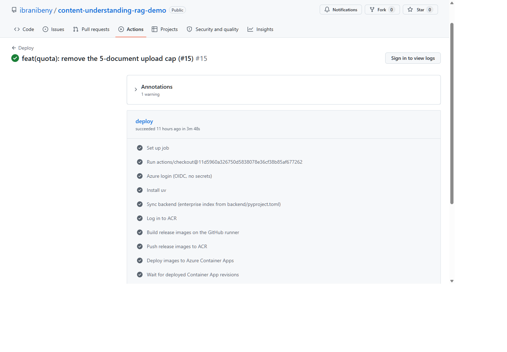

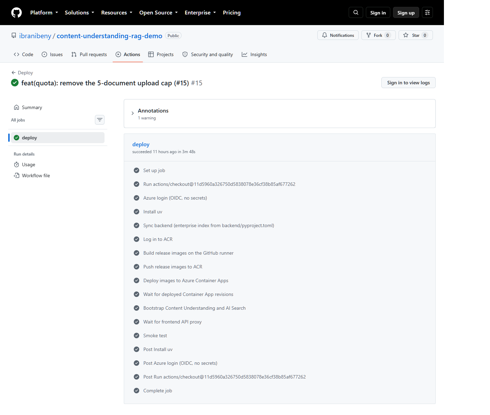

```powershell
az containerapp show `
  --resource-group <resource-group> `
  --name <container-app-name> `
  --query "properties.template.containers[0].image" `
  --output tsv
```

### Step 7 — Verify the deployed application

Run the automated smoke test, then repeat its contract visibly in the browser. Generate the public three-page Contoso fixture, upload it with page 2 selected, observe the eight ingestion stages, inspect extraction and metrics, and ask the deterministic marker question.

Expect `ORBIT-BRAVO-2` for “What unique marker is printed on page 2?” Open citation S1 and verify that it resolves to page 2 and contains the marker; then delete the document, refresh the session, and confirm that document count and reserved bytes decrease exactly once.

```powershell
uv --project backend run python scripts/smoke_test.py `
  --api-base <frontend-url> `
  --frontend-origin <frontend-url>

uv --project backend run python -c "from pathlib import Path; from scripts.smoke_test import SAMPLE_LINES, make_sample_pdf; Path('workshop-contoso.pdf').write_bytes(make_sample_pdf(SAMPLE_LINES, 3))"
```

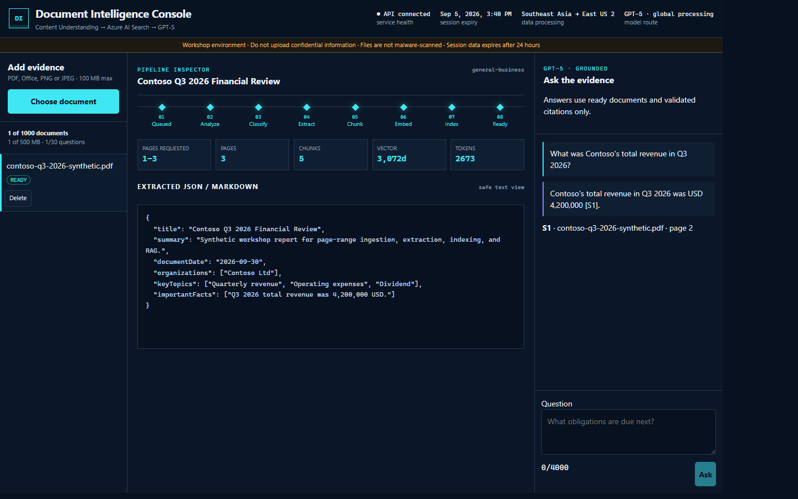

The full capture shows a separate range `1-3` revenue demonstration with all eight stages Ready, three processed pages, five chunks, 3,072-dimensional vectors, 2,673 tokens, structured extraction JSON, a grounded answer, and citation S1. The deterministic page-2 marker procedure above is the repeatable participant acceptance test.

### Step 8 — Operate, clean up, and retain evidence

Record the merge SHA, deployment run URL, smoke-test correlation ID, and sanitized Application Insights trace. Start the cleanup job to prove that tombstones and leases prevent stale workers from recreating deleted evidence.

Remove the environment only after the workshop retention decision. Retained operational evidence may contain identifiers, status, durations, and safe error codes, but it must not contain cookies, bearer tokens, SAS query strings, prompts, extraction payloads, or document content.

```powershell
az containerapp job start `
  --name <cleanup-job-name> `
  --resource-group <resource-group>

azd env select cudemo
azd down --purge --force
```

---

## 8. Document ingestion state machine

The document state is the durable account of what the system has completed, not merely a progress animation. A worker may advance that state only while the queue message identifies the same document, the record is current and unexpired, the Blob lease is valid, and the Azure Table ETag still matches.

Deletion participates in the same state machine rather than bypassing it. Moving to `Deleting` immediately hides the document and releases quota once, while physical cleanup acquires the same lease before removing Blob and Search artifacts and eventually purging the retained Table record.

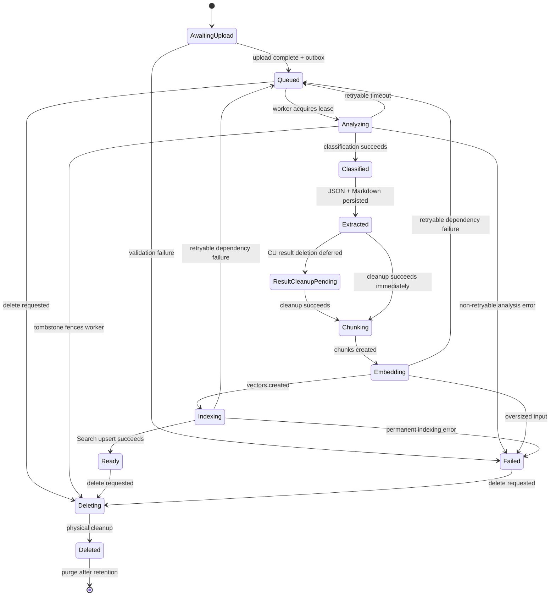

---

## 9. Upload and ingestion sequence

The API splits upload authorization from byte transfer. It validates metadata and page scope, reserves quota, creates the document record, and issues a short-lived user-delegation SAS; the browser then transfers the large payload directly to Blob Storage and returns the resulting ETag to complete the upload.

Completion atomically records `Queued` with an outbox item so durable state cannot be separated from delivery intent. The worker later owns processing through a renewable Blob lease, resumes stored Content Understanding operations after redelivery, and uses ETags to stop stale writes.

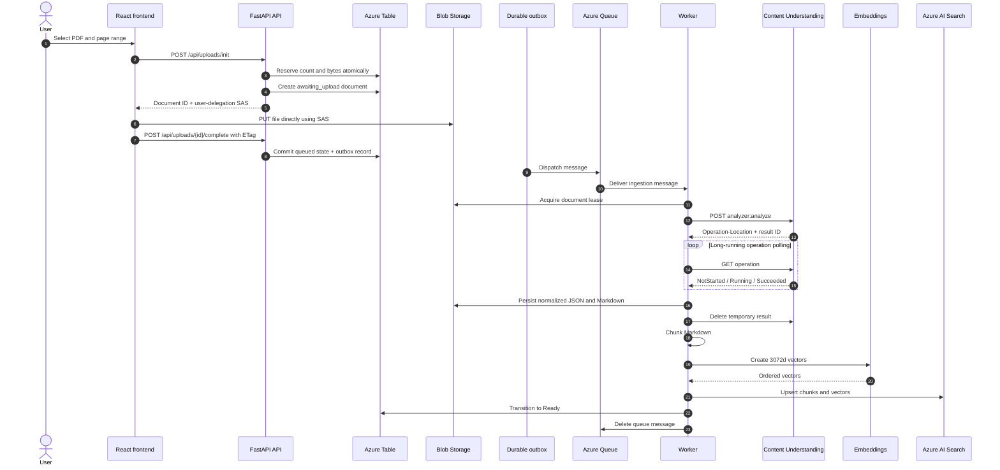

---

## 10. Grounded query sequence

Question answering begins by resolving only Ready documents owned by the current session. The API embeds the question, sends a hybrid text-and-vector query with session and document filters, and packages at most eight returned chunks as evidence labels S1–S8.

GPT-5 can stream prose and citation markers, but the server remains the citation authority. Every marker is checked against the retrieved set before it is emitted, so an unknown label is rejected and an empty evidence set returns a fixed insufficient-evidence response.

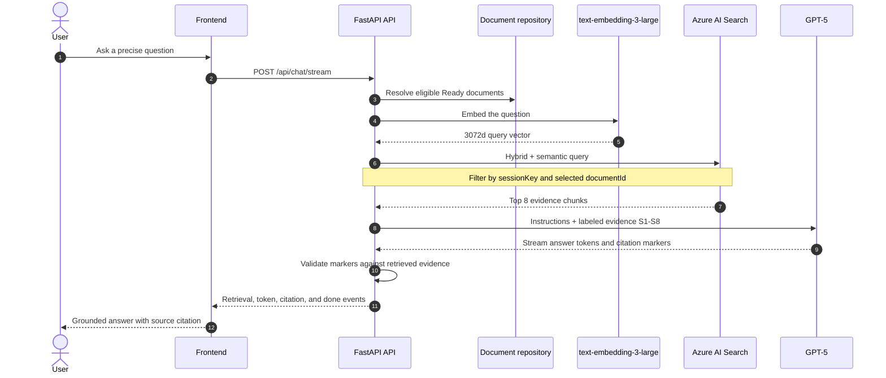

---

## 11. L400 implementation contracts

The following values are implementation contracts for this reference application rather than generic Azure service defaults. Participants should locate each value in source or configuration and identify which test would fail if it changed unexpectedly.

Read each table as an operational boundary. Values such as lease renewal, polling delay, vector dimensions, and filters interact across components, so changing one requires checking the neighboring retry, timeout, index, and validation assumptions.

**Upload and session**

| Contract | Value |
|---|---|
| Upload pattern | Init → direct Blob upload → Complete |
| SAS type | User delegation, create/write only |
| SAS lifetime | 15 minutes |
| Clock-skew allowance | 5 minutes |
| Per-file limit | 100 MB |
| Session byte limit | 500 MB |
| Default document count | 1,000 |
| PDF page selection | 1-based; maximum 300 unique pages |
| Content Understanding wire field | `range` |

**Queue and concurrency**

| Contract | Value |
|---|---|
| Queue visibility timeout | 120 seconds |
| Visibility renewal | Every 60 seconds |
| Blob lease duration | 60 seconds |
| Blob lease renewal | Every 30 seconds |
| Maximum worker attempts | 5 |
| Retry strategy | Exponential backoff with jitter |
| Outbox scan batch | 100 |
| Outbox scan interval | 5 seconds |

**Content Understanding**

| Contract | Value |
|---|---|
| API version | `2025-11-01` GA |
| Router | `business_document_router` |
| Poll delays | 1, 2, 4, 8, 15, 30, 30, 30 seconds |
| Output | Category, Markdown, fields, locators, pages, token counts |
| Categories | Invoice, receipt, contract, general-business |

**Chunking, embedding, and Search**

| Contract | Value |
|---|---|
| Tokenizer | `cl100k_base` |
| Maximum chunk | 800 tokens |
| Chunk overlap | 120 tokens |
| Embedding deployment | `text-embedding-3-large` |
| Vector dimensions | 3,072 |
| Maximum embedding batch | 64 inputs |
| Maximum input/request | 8,192 tokens |
| Search index | `document-chunks` |
| Vector algorithm and similarity | HNSW with cosine similarity |
| Retrieval size | Top 8 chunks |
| Isolation | `sessionKey` and selected `documentId` filters |

**Grounded generation**

| Contract | Value |
|---|---|
| Model | GPT-5 |
| Evidence labels | S1–S8 |
| Maximum generated output | 1,200 tokens |
| Citation validation | Marker must map to retrieved evidence |
| No-evidence behavior | Fixed insufficient-evidence response |

---

## 12. Identity and security model

The design separates runtime data access, image pulling, deployment, and model hosting into distinct trust paths. The shared `id-app` runtime identity accesses application data-plane services, `id-acrpull` only pulls images, GitHub uses a federated deployment principal, and the Foundry account identity invokes attached models.

This workshop keeps one shared runtime identity to make the MVP topology teachable, but the boundary remains visible so a production design can split it per workload. No storage account key, model key, connection string, Azure client secret, or raw session token is required in the normal application path.

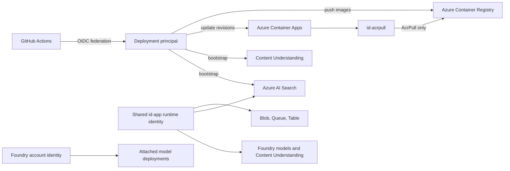

Public workshop safety rules:

- Use synthetic documents only.
- Uploads are not malware-scanned; never submit untrusted files.
- Confirm Southeast Asia → East US 2 processing approval.
- Never publish session cookies or bearer tokens.
- Never log SAS query strings.
- Never export prompts, extraction payloads, or document content into telemetry.
- Never store Azure client secrets in GitHub.
- Use immutable image tags based on the merge commit SHA.

---

## 13. Failure-injection exercises

Failure injection turns architecture claims into observable behavior. Before introducing a fault, participants predict the document state, retry classification, queue action, and telemetry; they then compare that prediction with the system result.

Recovery is only half of the acceptance criterion. The exercise must also prove that the winning state is preserved, stale work cannot resurrect evidence, retries reuse expensive operations where possible, and diagnostic records remain useful without exposing sensitive content.

| Injected failure | Expected result | Evidence to collect |
|---|---|---|
| Content Understanding `429` or `503` | Retryable dependency failure | Dequeue count, delay, same operation ID |
| Local poll window expires | Retryable `content_understanding_poll_timeout` | Document remains Analyzing; message deferred |
| Blob lease is lost | Retryable dependency failure | No later write using the stale lease |
| Azure Table ETag conflicts | Bounded conflict retry or safe stop | Winning state is preserved |
| Embedding input exceeds 8,192 tokens | Non-retryable failure | Document becomes Failed without content in telemetry |
| Fifth unsuccessful delivery | Poison envelope | Safe code, document ID, correlation ID, attempts |
| Invalid citation marker | Unsupported citation rejected | Fabricated source is not emitted |
| Delete during analysis | Tombstone fences worker | Document cannot be resurrected |

---

## 14. GitHub Copilot and pricing

GitHub Copilot can assist through inline completions, Chat, agent-mode changes, pull-request review, repository instructions, prompt files, and supported integrations. Its value is the shorter feedback loop between understanding a codebase, proposing a change, executing tools, and interpreting verification results.

Copilot does not own architecture, security, review policy, test evidence, or production accountability. Prompts should provide context, intent, constraints, and completion evidence, while CI and human governance remain independent controls over generated or edited code.

> Pricing snapshot from official GitHub material accessed 5 September 2026. Prices, credits, and feature availability can change; confirm the current plan page before purchasing.

| Plan | Price/month | Included monthly AI credits | Typical use |
|---|---:|---:|---|
| Free | $0 | Allowance; 2,000 completions/month | Learning and limited completions/chat |
| Pro | $10 | 1,500 total | Individual daily development |
| Pro+ | $39 | 7,000 total | Premium models and complex agent use |
| Max | $100 | 20,000 total | Sustained high-volume individual workflows |
| Business | $19/seat | 1,900 per user, pooled | Organization policy and management |
| Enterprise | $39/seat | 3,900 per user, pooled | Enterprise Cloud controls and audit |

Paid-plan code completions and next-edit suggestions are documented as unlimited. Organization overage is documented at $0.01 per credit when enabled, but the official GitHub plan pages remain the purchasing authority.

---

## 15. Runtime verification

Run the automated smoke journey first because it exercises the same public API contract as the browser: session creation, SAS request, Blob upload, upload completion, readiness polling, grounded SSE answer, citation presence, and deletion. A green result proves the deployed contract before visual observations are interpreted.

Repeat the proof in the browser with the generated fixture and page 2 selected. Inspect structured extraction and metrics, ask the exact marker question, open S1, delete the document, and refresh session quota; this closes the evidence chain from page selection to grounded source and then to lifecycle cleanup.

```powershell
uv --project backend run python scripts/smoke_test.py `
  --api-base <frontend-url> `
  --frontend-origin <frontend-url>

uv --project backend run python -c "from pathlib import Path; from scripts.smoke_test import SAMPLE_LINES, make_sample_pdf; Path('workshop-contoso.pdf').write_bytes(make_sample_pdf(SAMPLE_LINES, 3))"
```

Browser acceptance procedure:

1. Upload `workshop-contoso.pdf`.
2. Select only page `2`.
3. Wait for Queued → Analyze → Classify → Extract → Chunk → Embed → Index → Ready.
4. Confirm one processed page and a vector dimension of 3,072.
5. Inspect the extracted JSON and page, chunk, vector, and token metrics.
6. Ask: **What unique marker is printed on page 2?**
7. Expect: **ORBIT-BRAVO-2**.
8. Open S1 and confirm that it resolves to page 2 and contains the marker.
9. Delete the document and refresh the session.
10. Confirm document count and reserved bytes decrease once.

---

## 16. Definition of done

The workshop is complete only when participants can demonstrate both delivery integrity and evidence integrity. A green workflow without a verified citation is incomplete, just as a correct browser answer without a traceable merge SHA is incomplete.

Use the checklist as a final conversation rather than a mechanical scorecard. For each item, ask which artifact proves it, which control could invalidate it, and how an operator would diagnose a failure without exposing document content or credentials.

- [ ] A focused feature branch and atomic commit exist.
- [ ] The pull request documents intent and evidence.
- [ ] CI and CodeQL report success for the feature commit.
- [ ] The reviewed change is merged to `main`.
- [ ] GitHub Actions deploys through OIDC.
- [ ] SHA-tagged images run in Azure.
- [ ] Content Understanding and Search bootstrap succeeds.
- [ ] The synthetic document reaches Ready.
- [ ] The selected page range is honored.
- [ ] Structured extraction is available.
- [ ] Search vectors have 3,072 dimensions.
- [ ] The grounded answer includes a validated citation.
- [ ] Deletion releases quota exactly once.
- [ ] Cleanup removes Blob and Search artifacts.
- [ ] Application Insights contains safe operational evidence only.

---

## 17. References

Microsoft Learn establishes supported Azure and GitHub Actions behavior, while the public reference repository defines the exact implementation used by this workshop. When those sources appear to disagree, first verify the API version, documentation date, and repository commit.

GitHub documentation is the authority for current Copilot plans and pricing. Reopen all time-sensitive references before delivery, pin the application commit used by the lab, and keep the workshop screenshots framed as evidence for that specific completed run.

### Microsoft Learn

- [Introduction to GitHub](https://learn.microsoft.com/training/modules/introduction-to-github/)
- [GitHub Actions overview](https://learn.microsoft.com/dotnet/devops/github-actions-overview)
- [Deploy Azure Container Apps with GitHub Actions](https://learn.microsoft.com/azure/container-apps/github-actions)
- [Azure Content Understanding overview](https://learn.microsoft.com/azure/ai-services/content-understanding/overview)
- [Content Understanding document solutions](https://learn.microsoft.com/azure/ai-services/content-understanding/document/overview)
- [Hybrid search in Azure AI Search](https://learn.microsoft.com/azure/search/hybrid-search-overview)
- [Vector search in Azure AI Search](https://learn.microsoft.com/azure/search/vector-search-overview)

### GitHub and implementation

- [GitHub Copilot plans](https://docs.github.com/en/copilot/get-started/plans)
- [GitHub Copilot pricing](https://github.com/features/copilot/plans)
- [Reference application](https://github.com/ibranibeny/content-understanding-rag-demo)
- [Reference CI/CD runs](https://github.com/ibranibeny/content-understanding-rag-demo/actions)
- [Published workshop](https://ibranibeny.github.io/content-understanding-github-workshop/)
