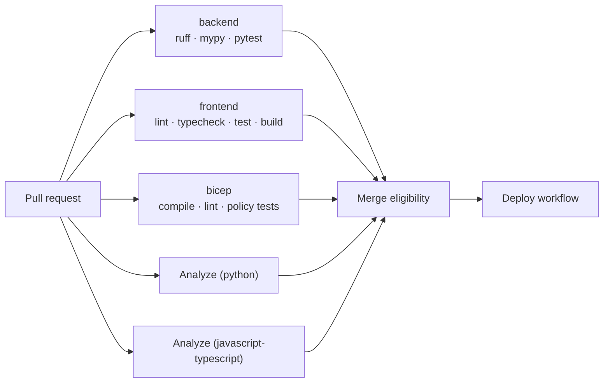
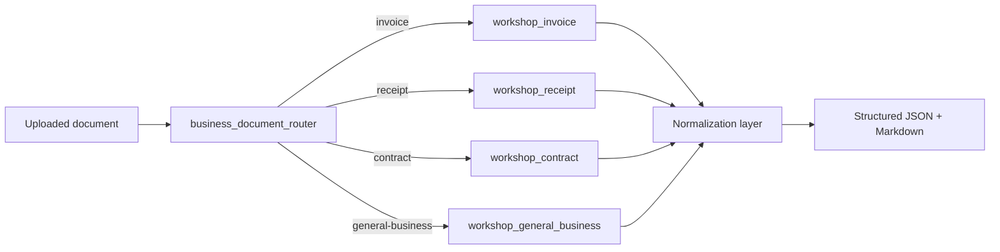
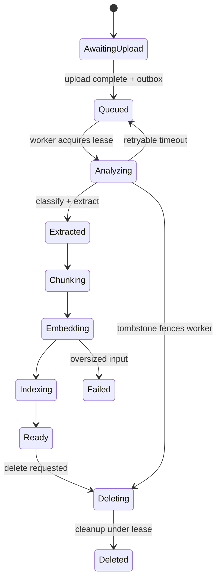
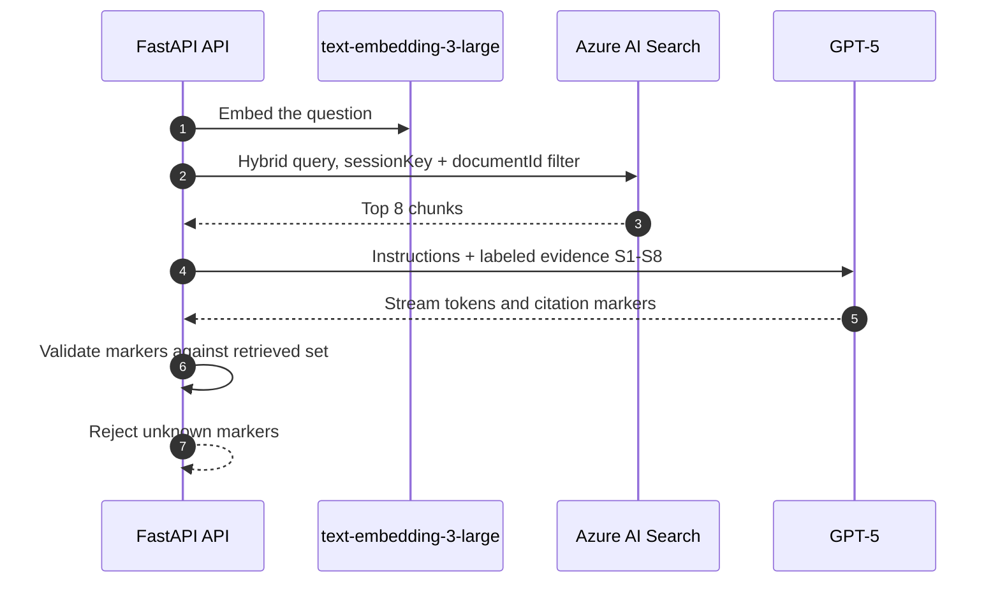

---
# Building Document Intelligence That Can Explain Itself

## GitHub · GitHub Copilot · Azure Content Understanding · Azure AI Search · GPT-5

**Level:** L400 — source-level architecture and implementation
**Duration:** 3.5–4 hours
**Audience:** Senior developers, platform engineers, DevOps engineers, solution architects
**Date:** 9 September 2026

> Speaker notes: This workshop follows a single software change from a developer branch all the way to a grounded, citable answer in production. The central claim is that a document-intelligence application becomes trustworthy not because a model produces fluent text, but because every step between the commit and the answer leaves durable, inspectable evidence.
>
> Set expectations early. Participants will not simply provision resources and watch a demo. They will inspect pull requests, required checks, static security analysis, OIDC federation, immutable image tags, asynchronous processing states, retrieval filters, and citation validation. By the end, the audience should be able to point at one sentence on a screen and explain exactly which commit, which container revision, and which source page produced it.

---

# Agenda

## Seven sections, four hours, one continuous evidence chain

| # | Section | Focus | Time |
|---|---------|-------|------|
| 1 | Title | Framing and objectives | 5 min |
| 2 | Agenda | Learning path and outcomes | 5 min |
| 3 | Overview | The connected system and architecture | 30 min |
| 4 | GitHub Code Review | Collaboration as a governance control | 40 min |
| 5 | GitHub CodeQL | Security analysis as a merge gate | 35 min |
| 6 | Content Understanding | Unstructured input to a stable contract | 60 min |
| 7 | Workshop Scenario | Build, deploy, verify, and operate | 65 min |

> Speaker notes: The order is deliberate and should not be rearranged. Software delivery comes first because a runtime result is only meaningful once the audience knows which source produced it. Code review and CodeQL then establish the human and automated gates that decide what is even allowed to reach production.
>
> Only after those controls are understood do we open the document pipeline. This sequencing prevents the most common failure in AI workshops, where participants leave impressed by an answer but unable to explain its provenance, its failure modes, or the controls that stopped a bad change from shipping.

---

# Overview · The Problem

## Extracting text is easy; proving the answer is hard

- Business documents arrive as unstructured PDFs, scans, and Office files
- Users want direct answers, not a search results page
- Generative answers are fluent even when they are wrong
- Auditors ask *which page* supports the claim, not *which model*
- Deleted content must actually disappear from every index
- Every answer must trace back to a reviewed, released version

> Speaker notes: Most document-AI demonstrations stop at the moment a model produces a plausible sentence. That is the easiest part of the problem and the least valuable in a regulated enterprise. The difficult part is establishing a chain of custody: which bytes entered the system, which pages were processed, which chunk supported the claim, and which release of the software made the decision.
>
> This workshop treats that chain as the actual product. The application is deliberately built so a reviewer can interrogate any answer, follow it back through retrieval to an indexed chunk, then to a page range of an uploaded document, and finally to the commit and container image that were running at the time. When the audience internalizes this framing, the remaining architecture decisions become obvious rather than arbitrary.

---

# Overview · The Connected System

## Six capabilities, one operating model

| Capability | Role in the system |
|---|---|
| **GitHub** | Immutable history, review surface, required checks |
| **GitHub Copilot** | Faster implementation and automated PR review |
| **GitHub Actions** | Secretless release with commit-SHA provenance |
| **Azure Content Understanding** | Unstructured content to schema-aligned output |
| **Azure AI Search + GPT-5** | Session-scoped retrieval and grounded generation |
| **Azure Container Apps** | Scale-to-zero runtime with managed identity |

> Speaker notes: These are usually taught as separate products, which is precisely why teams struggle to connect them in practice. In this workshop they form one operating model: GitHub decides what may exist in production, Actions carries it there without a stored secret, and Azure executes it with identities that never hold keys.
>
> Emphasize the boundary between the two planes. The delivery plane changes executable software and never touches customer content. The evidence plane moves document content but can never alter the software. Keeping these separate is what allows an operator to answer "what changed?" and "what did it read?" as two independent, provable questions.

---

# Overview · Architecture at a Glance

## A delivery lane and an evidence lane


- **Rose lane:** branch → PR → checks → OIDC → ACR → Container Apps revision
- **Blue lane:** ten numbered steps from upload to validated citation
- API issues **metadata + SAS authorization**; the browser performs the **direct Blob PUT**
- Foundry serves three calls: page analysis, chunk embeddings, question embedding + generation
- Southeast Asia hosts the application and data plane; East US 2 hosts Foundry
- Shipped as editable `.drawio` plus `.svg` and `.jpg` exports

> Speaker notes: Narrate the diagram in two passes rather than describing every box at once. In the first pass, follow only the top lane from left to right, where the GitHub brand marks identify each governance control: a reviewed commit passes the pull request, CI, and CodeQL before protected `main` accepts it, and the deploy workflow then exchanges an OIDC token for Azure access, publishes SHA-tagged images, and creates new Container Apps revisions. Nothing in this lane carries document content.
>
> In the second pass, walk the ten numbered steps, and pause on step 4 because the upload split is the most misread part of the design. The API is not a file relay: it validates metadata and page scope, reserves quota, and issues a short-lived user-delegation SAS, while the browser transfers the bytes directly to Blob Storage. Steps 6 and 7 then convert the document into indexed evidence, steps 8 and 9 form the answering loop that ends in a validated citation, and step 10 with the dashed telemetry line proves that deletion and observability are part of the design rather than afterthoughts.

---

# GitHub Code Review · Why It Exists

## Review converts private work into a shared engineering decision

- A branch isolates risk; a commit records intent
- A pull request exposes reasoning, not just a diff
- Reviewers evaluate architecture, security, and test evidence
- Required checks make merge eligibility objective
- The merge SHA becomes the release and correlation key
- Rollback is only realistic when commits are atomic

> Speaker notes: Teams often describe code review as a quality ritual, which undersells it. Review is the moment where an individual decision becomes an organizational one, and it is the last point where context is cheap to supply. Once a change is merged, released, and running, reconstructing intent costs far more than writing it down did.
>
> Frame the discipline concretely for this repository. A commit should express one behavior so it can be reverted independently, and a pull request should let a reviewer evaluate every acceptance criterion without any private context. When those two properties hold, incident response later becomes a search problem rather than an archaeology project.

---

# GitHub Code Review · Anatomy of a Reviewable PR

## What the description must carry

| Section | Question it answers |
|---|---|
| Problem | What is broken or missing today? |
| Change | What behavior changes, and where? |
| Architecture impact | Which boundaries or contracts move? |
| Security impact | Identity, data, secrets, or permissions affected? |
| Test evidence | Which commands were run, with what result? |
| Rollback | How is this reverted safely? |

> Speaker notes: A reviewer's time is the scarcest resource in the delivery chain, so the pull request should spend it on judgment rather than reconstruction. Each row on this table removes a question the reviewer would otherwise have to ask, and each answer becomes durable evidence long after the conversation is forgotten.
>
> The security and rollback rows deserve particular attention in this application. Because the system handles document content, issues short-lived SAS tokens, and runs under managed identity, a seemingly small change can move a trust boundary. Making that impact explicit in the description is what allows a reviewer to catch it before CodeQL, CI, or production ever sees the change.

---

# GitHub Code Review · Copilot and Humans

## Automated review raises the floor; humans set the bar

- Copilot automatic review is enabled in the branch ruleset
- Copilot is effective at local defects, typos, and obvious risks
- Humans own architecture, threat models, and business correctness
- Repository instructions encode conventions where the work happens
- Prompts should state context, intent, constraints, and evidence
- AI-assisted code passes the *same* gates as any other code

> Speaker notes: The ruleset created by `configure-github.ps1` requests automatic Copilot review on pull requests, with a graceful fallback when the plan does not support it. Treat that as a floor-raising mechanism: it consistently catches the class of defects that humans skim past when reviewing a large diff late in the day.
>
> Be equally clear about what it does not replace. Copilot does not own architectural judgment, threat modeling, test sufficiency, or deployment accountability. The correct measure of AI assistance in this workshop is not how much code it generated, but whether the resulting change passed verification and left evidence a reviewer could trust.

---

# GitHub Code Review · The Merge Gate

## Ruleset `main-protection` on the default branch

| Rule | Configured value |
|---|---|
| Pull request required | Yes |
| Required approving reviews | **0** (workshop setting) |
| Automatic Copilot review | Enabled (with fallback) |
| Dismiss stale reviews on push | Yes |
| Required status checks | `backend`, `frontend`, `bicep`, `Analyze (python)`, `Analyze (javascript-typescript)` |
| Strict status checks | Yes — branch must be up to date |
| Non-fast-forward | Blocked |

> Speaker notes: Be transparent about the zero-approval setting rather than glossing over it. This workshop repository is operated by a single maintainer, so requiring human approval would block the lab entirely. The durable promotion evidence for pull request `#15` is therefore its successful checks plus the merge record, not a reviewer signature.
>
> State the production recommendation explicitly. In a team setting, raise the required approving review count, enable code-owner review for infrastructure and identity paths, and consider requiring review-thread resolution. The mechanism demonstrated here is correct; only the threshold is tuned for a single-operator teaching environment.

---

# GitHub Code Review · Evidence

## Pull request #15, reconstructed from durable records


- Source branch, target `main`, and full changed-file surface
- Rationale, test evidence, and commit list preserved after merge
- Feature commit `dc77911`; squash merge `7763b09`
- Checks are attached to the commit, not to a person's memory

> Speaker notes: This is the archived final state of the pull request after merge, which is exactly what an auditor or on-call engineer would open months later. Point out that the value is not the screenshot itself but the fact that GitHub retains this surface permanently and links it to an immutable commit.
>
> Walk the audience across the identifiers deliberately. The feature commit is what CI and CodeQL analyzed, and the squash merge commit is what the deployment workflow consumed as its build input. Two distinct SHAs with two distinct roles is a detail that confuses many teams, and clarifying it here prevents confusion during the deployment section.

---

# GitHub CodeQL · What It Actually Is

## Semantic code analysis, not pattern matching

- CodeQL builds a queryable database of the codebase
- Queries reason about data flow from source to sink
- Detects injection, unsafe deserialization, and taint paths
- Linters check style; type checkers check contracts
- CodeQL asks whether untrusted data can reach dangerous code
- Results appear as security alerts and as merge-blocking checks

> Speaker notes: The most common misconception is that CodeQL is a stricter linter. It is closer to a compiler front end plus a query engine: the source is converted into a relational database of program elements, and security queries then trace how values flow through the program.
>
> This distinction matters for how findings are treated. Ruff and mypy failures usually indicate a local mistake that a developer fixes in seconds. A CodeQL finding typically describes a path — untrusted input reaching a sensitive operation — and evaluating it requires understanding the boundary the path crosses. Teach the audience to read the flow, not just the alert title.

---

# GitHub CodeQL · Workflow Configuration

## Two languages, least privilege, pinned actions

```yaml
jobs:
  analyze:
    name: Analyze (${{ matrix.language }})
    permissions:
      security-events: write
      actions: read
      contents: read
    strategy:
      fail-fast: false
      matrix:
        language: [python, javascript-typescript]
    steps:
      - uses: github/codeql-action/init@6f5948df… # v3
        with:
          languages: ${{ matrix.language }}
          build-mode: none
      - uses: github/codeql-action/analyze@6f5948df… # v3
```

> Speaker notes: Several deliberate choices are visible in this excerpt. The matrix analyses Python and JavaScript/TypeScript independently with `fail-fast: false`, so a failure in one language still yields results for the other. `build-mode: none` is appropriate here because neither language requires a compiled build for extraction.
>
> Highlight the supply-chain hygiene as well. Third-party actions are pinned to full commit SHAs rather than moving tags, and permissions are scoped to the minimum: `security-events: write` to publish alerts, plus read-only access to actions and contents. These are the same practices participants should apply to any workflow they own.

---

# GitHub CodeQL · The Full Gate Matrix

## Five independent signals guard one merge



> Speaker notes: Insist that these five checks are not interchangeable. A green backend test suite says nothing about whether the infrastructure template still compiles, and a successful production build says nothing about whether user input can reach a dangerous sink. Each job answers a question the others cannot.
>
> This is also why the ruleset requires all five by name rather than accepting a single aggregate result. Participants should open each job individually during the lab instead of trusting the summary checkmark, because reading a specific failure is the skill that matters during a real incident.

---

# GitHub CodeQL · Reading Results

## Triage before you touch the code

| Step | Question |
|---|---|
| 1. Locate | Which file, function, and line? |
| 2. Trace | What is the source and what is the sink? |
| 3. Assess | Can untrusted input truly reach that sink? |
| 4. Decide | Fix the flow, add validation, or justify a dismissal |
| 5. Verify | Re-run the analysis on the updated commit |

```powershell
gh pr checks <pr-number> --watch
gh run view <run-id> --log-failed
```

> Speaker notes: The ordering here prevents the two most common triage mistakes. The first is editing code before understanding the reported flow, which frequently silences the alert without closing the vulnerability. The second is dismissing a finding because it "looks like a false positive" without tracing whether the source is genuinely trusted.
>
> Note that dismissal is a legitimate outcome when it is justified and recorded. What is never acceptable is an undocumented dismissal or a change that merely breaks CodeQL's ability to see the path. Verification on the updated commit closes the loop and produces evidence that the fix, not the analysis, changed.

---

# GitHub CodeQL · Evidence

## Green analysis attached to the feature commit


- Both matrix jobs completed successfully for commit `dc77911`
- Results are published as security alerts, retained per branch
- Runs execute on pull requests **and** on pushes to `main`
- Screenshots prove run results; the ruleset proves enforcement

> Speaker notes: Draw a careful distinction that participants often blur. This screenshot proves that the analysis executed and succeeded for a specific commit. It does not, by itself, prove that the check is required before merge — that fact lives in the repository ruleset and must be inspected separately.
>
> Explain why CodeQL also runs on pushes to `main`. Pull-request runs protect the merge decision, while `main` runs maintain the branch's baseline alert state over time. Without the second trigger, alert history becomes fragmented and it is harder to tell whether a finding is newly introduced or long-standing.

---

# Content Understanding · The Contract Problem

## From messy files to something a program can trust

- Input: PDFs, images, Office files, audio, video
- Output must be predictable enough to automate against
- Layout carries meaning that raw text extraction destroys
- Different document classes need different fields
- Downstream retrieval needs stable, locatable text
- The upload API must not change per document type

> Speaker notes: The central design tension is that inputs are unbounded while consumers need bounded, predictable structure. If every document class forced a different API shape, the application would leak document-format concerns into upload handling, session management, and the user interface.
>
> Azure Content Understanding resolves this with the analyzer concept, which acts as a reusable processing contract. The analyzer defines which modalities are accepted, how content and structure are extracted, which categories and fields are produced, and how results stay grounded in the source. The application programs against that contract instead of against file formats.

---

# Content Understanding · Analyzer Routing

## One entry point, four extraction schemas



> Speaker notes: The router is the stable entry contract for every upload. It classifies the document, selects one specialized analyzer, and returns the matching extraction schema — which means the application never has to guess the document type before calling the service.
>
> The normalization layer is equally important and frequently omitted in demos. Absent typed values are converted to null so optional data remains usable, while malformed or unknown field types fail closed. That asymmetry is intentional: missing data is a normal condition, but unexpected schema drift must never silently contaminate chunks, search results, or grounded answers.

---

# Content Understanding · The REST Contract

## A long-running operation, resumable by design

```http
POST /contentunderstanding/analyzers/{router}:analyze
     ?api-version=2025-11-01

{ "inputs": [ { "url": "<short-lived SAS>", "range": "1-3" } ] }

→ 202  Operation-Location: <operation url>
→ GET  <operation url>  until Succeeded
```

- Poll delays: **1, 2, 4, 8, 15, 30, 30, 30** seconds
- Worker persists the operation URL **and** result ID
- Redelivery resumes the stored operation, never resubmits
- Page range uses the GA wire field `range`, 1-based, max 300 pages

> Speaker notes: The analyze call returns an operation location rather than a finished document, which makes the client responsible for polling. The critical implementation detail is that the worker persists both the operation URL and the result identifier before polling begins.
>
> That persistence is what makes redelivery safe. If the local polling window closes and the queue message is delivered again, the worker resumes the existing operation instead of submitting duplicate generative work. Participants should confirm this behavior in telemetry by observing the same operation identifier across retry attempts.

---

# Content Understanding · Dual Output

## JSON for automation, Markdown for retrieval

| Output | Purpose | Consumer |
|---|---|---|
| Structured JSON | Dates, organizations, topics, facts | UI inspection, automation |
| Layout-aware Markdown | Headings, order, source locators | Chunking and retrieval |
| Category | Selected extraction schema | Routing and display |
| Page and token counts | Processing evidence | Metrics and cost control |

- Page ranges limit cost, latency, and data exposure
- Locators are what make a citation resolvable back to a page

> Speaker notes: These two outputs are complementary rather than redundant. JSON gives the API a predictable contract so the interface and downstream automation never have to parse model prose. Markdown preserves enough document structure that chunking can respect headings and sections instead of slicing text arbitrarily.
>
> Page ranges deserve emphasis because they serve three goals at once. They reduce processing cost and latency, they narrow the amount of content that crosses regions for AI processing, and they make the workshop's verification deterministic — a participant can select page 2 and predict exactly which evidence should be retrievable afterwards.

---

# Content Understanding · Into the RAG Chain

## Five contracts between extraction and an answer

| Stage | Contract |
|---|---|
| Chunk | `cl100k_base`, max 800 tokens, 120-token overlap, deterministic IDs |
| Embed | `text-embedding-3-large`, 3,072 dims, max 64 inputs, 8,192 tokens |
| Index | `document-chunks`, HNSW + cosine, filterable `sessionKey`/`documentId` |
| Retrieve | Hybrid + semantic query, session filtered, top 8 chunks |
| Generate | GPT-5, evidence labeled `S1`–`S8`, max 1,200 output tokens |

> Speaker notes: Present this as a chain of explicit contracts rather than a single model call. Deterministic chunking preserves context and locators, embeddings fix the vector shape, Search enforces session-scoped retrieval, and generation receives only the evidence the server selected.
>
> Each row is also a failure exercise. Oversized embedding inputs fail non-retryably, partial index batches raise transient errors, cross-session document identifiers return no eligible evidence, and an unknown citation marker is rejected outright. Participants learn the contracts fastest by deliberately violating them and observing whether the system retries, fails closed, or returns the fixed insufficient-evidence response.

---

# Workshop Scenario · The Task

## Upload a synthetic report, then prove the answer

1. Generate the deterministic three-page Contoso fixture
2. Upload it and select **page 2** only
3. Watch eight stages: Queued → … → Ready
4. Ask: *"What unique marker is printed on page 2?"*
5. Expect: **`ORBIT-BRAVO-2`** — then open citation `S1`
6. Delete the document and confirm quota is released

> Speaker notes: The scenario uses synthetic content exclusively. Selected document content and derived evidence cross from Southeast Asia to East US 2 for AI processing, uploads are not malware-scanned, and the environment is a teaching environment — so real, confidential, or untrusted files are never acceptable inputs.
>
> The deterministic marker is what turns this from a demonstration into a test. Because the fixture is generated by the repository's own smoke-test helper, every participant knows the expected answer in advance and can therefore evaluate not just whether the model responded, but whether the citation resolves to the correct page and contains the expected string.

---

# Workshop Scenario · Ingestion State Machine

## Durable state, fenced by lease and ETag



> Speaker notes: Document state is the durable record of what the system has actually completed, not a progress animation for the user interface. A worker may advance that state only when the queue message identifies the same document, the record is unexpired, the Blob lease is still valid, and the Azure Table ETag still matches.
>
> Present those four conditions as one composite fence. A valid queue message does not override a newer delete decision, and a valid lease does not authorize a stale repository write. This is exactly why deletion participates in the state machine rather than bypassing it: the tombstone hides the document immediately and releases quota once, while physical cleanup removes artifacts under the same lease.

---

# Workshop Scenario · Grounded Answers

## The server is the citation authority



> Speaker notes: The model streams prose and citation markers, but it is never trusted to define what a valid source is. Every marker is checked against the evidence set the server actually retrieved, so an unknown label is rejected before it reaches the user and an empty evidence set produces a fixed insufficient-evidence response.
>
> Combine this with the retrieval filter to close the isolation story. Because queries are filtered by session key and selected document identifier, a participant cannot retrieve another session's evidence even if they somehow supplied a foreign document identifier. Grounding is therefore enforced by server-side data scoping and validation, not by prompt instructions.

---

# Workshop Scenario · Deployment Evidence

## Eight checkpoints, one continuous chain


| # | Checkpoint | Durable evidence |
|---|---|---|
| 01–03 | Repository, commit, pull request | `dc77911`, PR `#15` |
| 04 | CI and CodeQL gates | Five required checks green |
| 05 | Squash merge to `main` | `7763b09` |
| 06 | OIDC release to Azure | Run `33872688415`, SHA-tagged image |
| 07–08 | Runtime verification, cleanup | Ready pipeline, quota release |

> Speaker notes: Each checkpoint produces evidence that survives the session, which is the property that makes the chain auditable. The workflow exchanges a GitHub OIDC token for Azure access, so no Azure client secret is ever stored, and the merge SHA binds source, image, revision, and telemetry together.
>
> Point out the release gates beyond image publication. The workflow waits for revision provisioning, bootstraps the Content Understanding analyzer and Search index, verifies frontend proxy readiness, and runs the deployed smoke test. Publishing an image and proving the system can serve its documented contract are two different claims, and only the second one justifies calling a deployment successful.

---

# Workshop Scenario · Definition of Done

## The application, proven end to end


- [ ] Atomic commit, reviewable pull request, five green checks
- [ ] Merge commit on `main` triggers the SHA-tagged release
- [ ] Synthetic document reaches Ready with the requested pages
- [ ] Answer cites only validated, retrieved evidence
- [ ] Deletion releases quota; cleanup removes Blob and Search artifacts
- [ ] Telemetry contains safe metadata only — no content, prompts, or SAS

> Speaker notes: This capture shows the range `1-3` variant of the scenario with three processed pages, five chunks, 3,072-dimensional vectors, and 2,673 tokens, alongside structured extraction and a grounded answer with citation `S1`. Have participants reproduce it with the deterministic page-2 marker procedure rather than relying on the image, because that single pass exercises quota, retrieval scoping, citation validation, and lifecycle cleanup together.
>
> Treat the checklist as a conversation rather than a scorecard, then close by returning to the opening claim. The application is trustworthy because each link is independently inspectable: review governs what may exist, CodeQL governs what is safe to merge, OIDC and SHA tags govern what actually runs, and server-side retrieval and citation validation govern what may be said. Point participants to the published workshop, the reference implementation, and the editable architecture so they can rebuild this chain in their own repositories.

---
